<a name="readme-top"></a>

# 📗 Table of Contents

- [📗 Table of Contents](#-table-of-contents)
- [📖 GitHub Commits ](#📖-github-commits)
  - [🛠 Built With ](#-built-with-)
    - [Tech Stack ](#tech-stack-)
    - [Key Features ](#key-features-)
  - [🚀 Live Demo ](#-live-demo-)
  - [💻 Getting Started ](#-getting-started-)
    - [Prerequisites](#prerequisites)
    - [Setup](#setup)
    - [Install](#install)
    - [Usage](#usage)
    - [Launch website](#launch-website)
    - [Run tests](#run-tests)
  - [👥 Authors ](#-authors-)
  - [🔭 Future Features ](#-future-features-)
  - [🤝 Contributing](#🤝-contributing)
  - [🙏 Acknowledgments ](#-acknowledgments-)
  - [📝 License ](#-license-)

# 📖 GitHub Commits <a name="about-project"></a>

This project is a web application that displays the commit history of a public GitHub repository. It’s built using NestJS for the backend and Astro for the frontend.

The application fetches commit data from the GitHub API and presents it in a user-friendly format. Users can filter commits by author, date, and keyword, allowing them to easily find specific commits in the repository’s history.

The backend handles API requests and applies filters as needed. It’s designed to be robust and efficient, ensuring that users can retrieve commit data quickly and accurately.

The frontend provides an intuitive interface for users to interact with. It’s built with Astro, a modern front-end framework, React, to add dynamism, embedded throughout the astro dynamic islands, and styled with Tailwind CSS for a clean and responsive design.

This project demonstrates proficiency in working with APIs, front-end and back-end JavaScript frameworks, and modern web development practices. It’s designed to be easy to install and run, with clear instructions provided in the README.

Please note that this application is designed to work with public repositories only. It does not support private repositories or real-time updates; the page must be refreshed to get the latest commits.

## View endpoints responses

### endpoint /commits

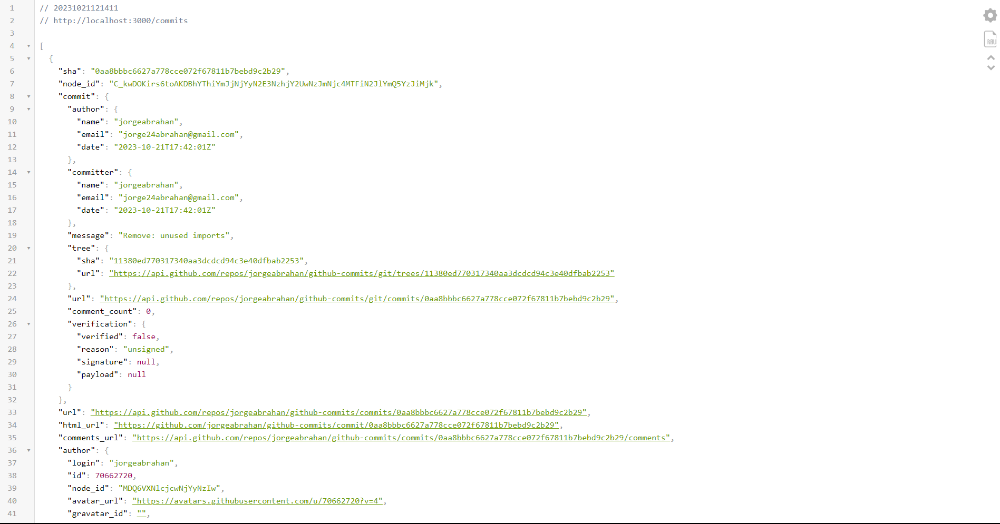

### endpoint /commits/author

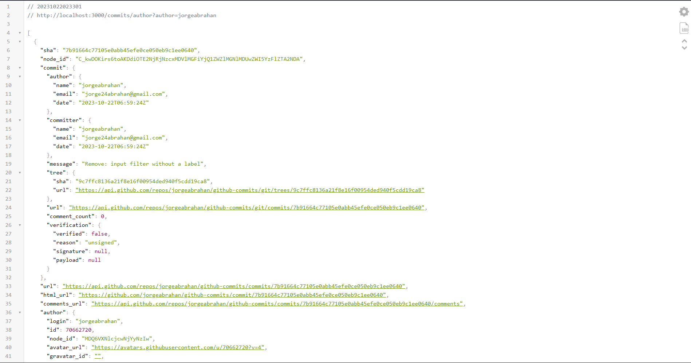

### endpoint /commits/date

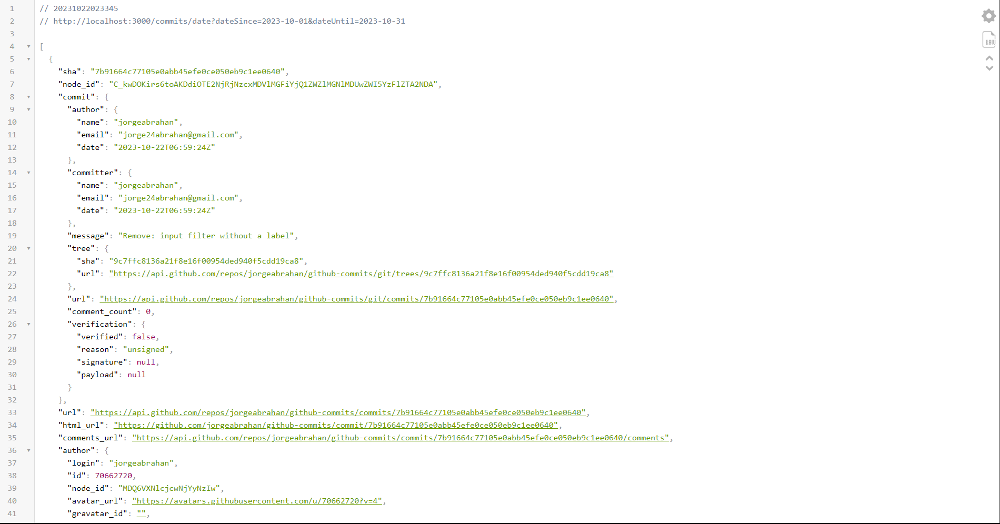

### endpoint /commits/keyword

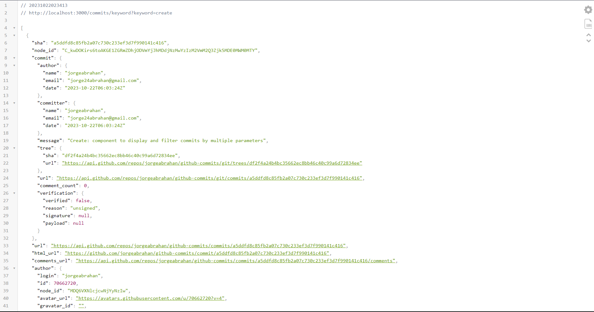

### endpoint /commits/filters

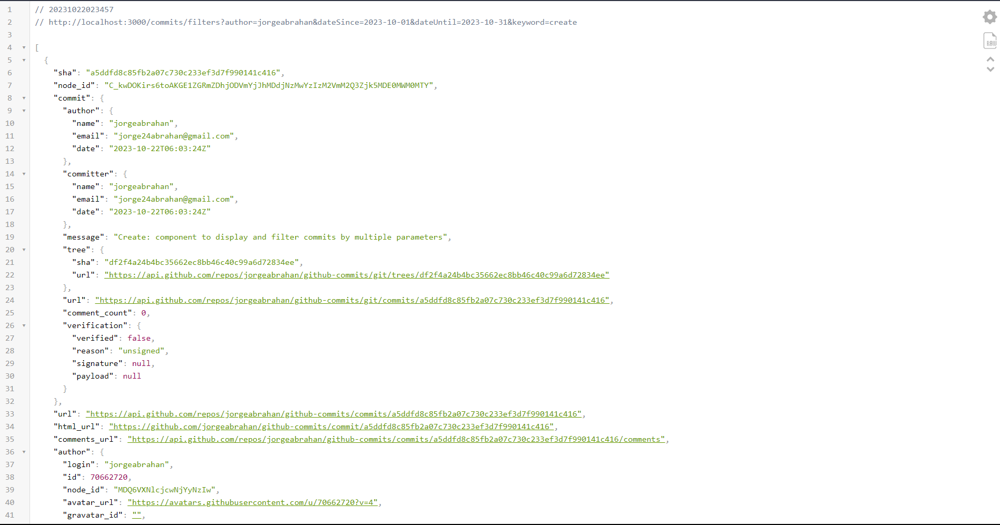

## View frontend pages

### / (index)

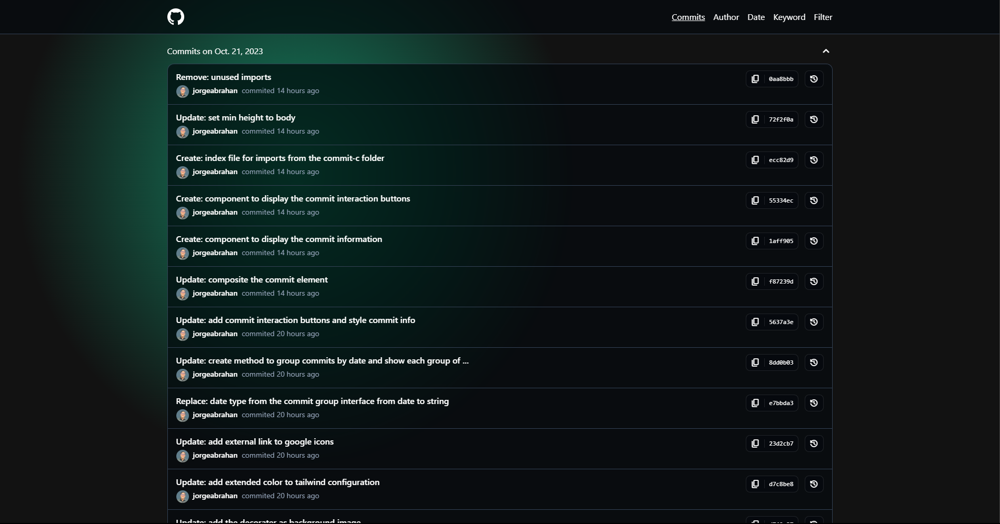

### /author

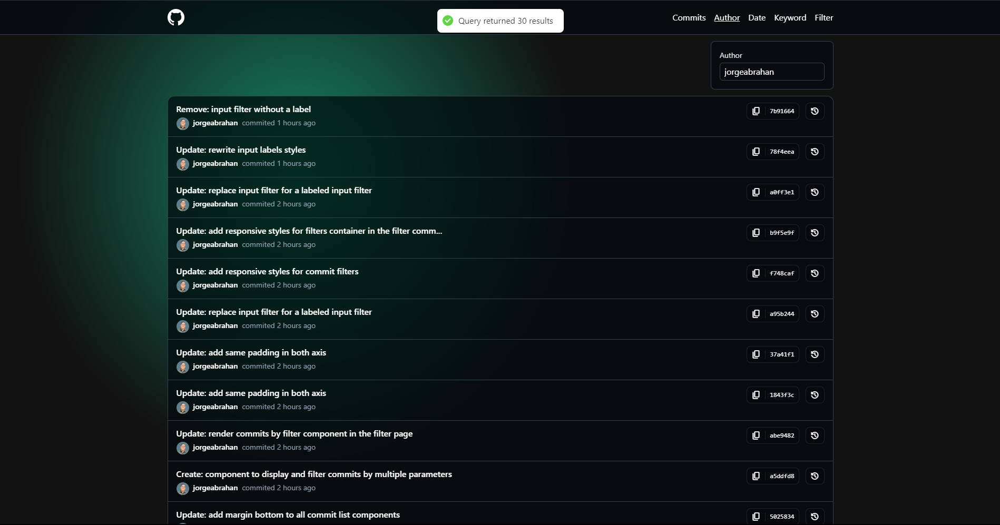

### /date

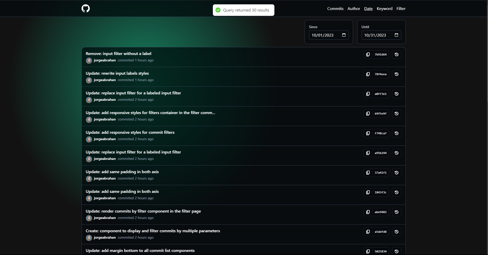

### /keyword

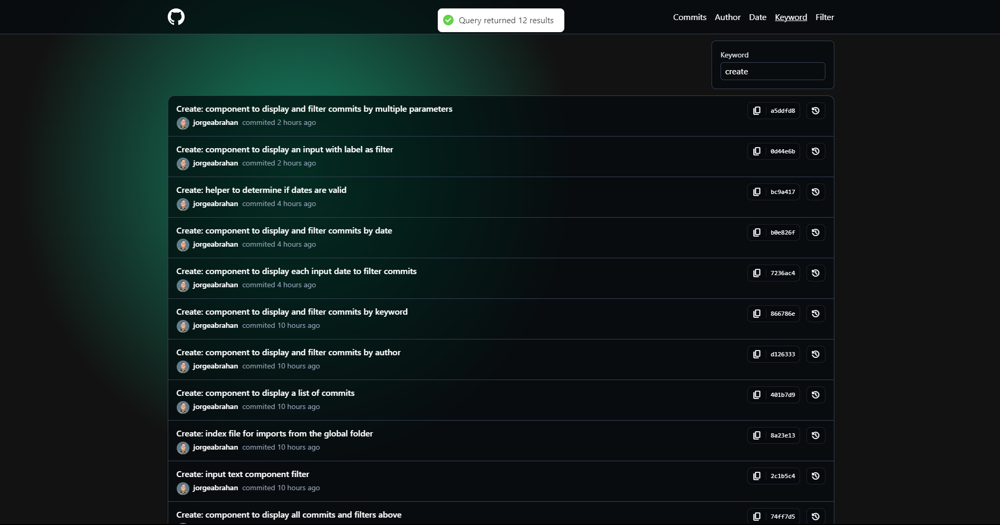

### /filter

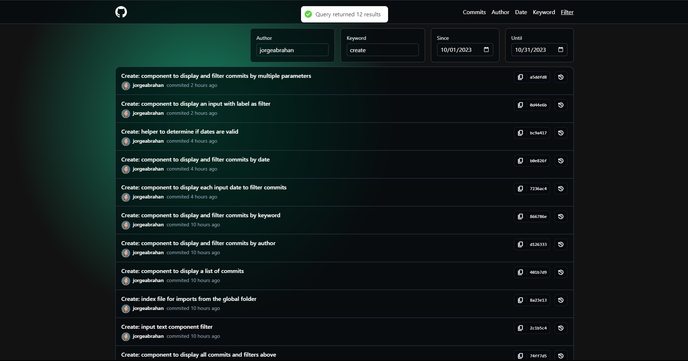

## 🛠 Built With <a name="built-with"></a>

### Tech Stack <a name="tech-stack"></a>

<details>
  <summary>Client</summary>
  <ul>
    <li><a href="https://astro.build/">Astro</a></li>
    <li><a href="https://tailwindcss.com/">Tailwind</a></li>
    <li><a href="https://react.dev/">React</a></li>
    <li><a href="https://www.typescriptlang.org/">Typescript</a></li>
  </ul>
</details>

<details>
  <summary>Backend</summary>
  <ul>
    <li><a href="https://nestjs.com/">NestJS</a></li>
    <li><a href="https://www.typescriptlang.org/">Typescript</a></li>
    <li><a href="https://developer.github.com/v3/">GitHub API</a></li>
  </ul>
</details>

### Key Features <a name="key-features"></a>

- GitHub Commit History Display:
The application fetches and displays the commit history from this public GitHub repository, providing a clear overview of the project's development timeline.

- Flexible Filtering Options:
Users can filter commits by various parameters such as author, date range, and keyword, allowing for targeted analysis and exploration of the project's commit history.

<p align="right">(<a href="#readme-top">back to top</a>)</p>

## 💻 Getting Started <a name="getting-started"></a>

To get a local copy up and running, follow these steps.

### Prerequisites

Before you can run this project, you will need to have the following installed on your system:

- **Node.js:** You will need Node.js to run your server and client code. You can check if you already have Node.js installed by running `node -v` in your terminal. If it’s not installed, you can [download it from the official Node.js website](https://nodejs.org/en).

- **npm (Node Package Manager):** npm is the default package manager for Node.js and it gets installed automatically when you install Node.js. You will use it to install your project dependencies. You can check if you already have npm installed by running `npm -v` in your terminal.

- **NestJS CLI (Optional):** The NestJS CLI is not necessary for running the project as all necessary dependencies will be installed via npm when `npm i` is run in the project directory. However, if you plan on doing any further development on the backend using NestJS, you might consider installing the NestJS CLI globally on your system to facilitate the creation and management of NestJS modules. It can be installed with `npm i -g @nestjs/cli`.

- **Git:** You will need Git to clone the project repository. You can check if you already have Git installed by running `git --version` in your terminal. If it’s not installed, you can [download it from the official Git website](https://git-scm.com/downloads).

### Setup

Open your terminal and clone this repository to your desired folder:

```sh
git clone https://github.com/jorgeabrahan/github-commits.git
```

Afterwards, navigate to it:

```sh
cd github-commits
```

### Install

Since this repository holds two projects in one (backend, frontend) we will need to install dependencies in both of them. Type the following commands in your terminal:

> you should already be positioned in the project folder if you're following the instructions in order, if not, start from the [setup instructions](#setup)

```sh
# navigate to frontend
cd frontend
# install frontend project dependencies
npm i
# go back to root folder
cd ..
# navigate to backend
cd backend
# install backend project dependencies
npm i
# go back to root folder
cd ..
```

### Usage

Let's first initialize the backend project development server by typing the following commands:

> you should already be positioned in the project folder if you're following the instructions in order, if not, start from the [setup instructions](#setup)

```sh
# navigate to backend
cd backend
# initialize watch mode (development server)
npm run start:dev
```

Since development server is running on watch mode you shouldn't be able to keep typing in your terminal at this point, therefore, you'll need to open a new terminal in the project root folder path (github-commits) and type the following commands to start the frontend project development server:

```sh
# navigate to frontend
cd frontend
# initialize watch mode (development server)
npm run dev
```

### Launch website

Now that the development server from both projects is running let's launch both websites:

#### backend

NestJS listens on port **3000** by default, therefore you'll need to open the following url in your browser to visualize the backend project responses:

```
http://localhost:3000
```

This will show you a welcome message that indicates that the backend project is up and running:

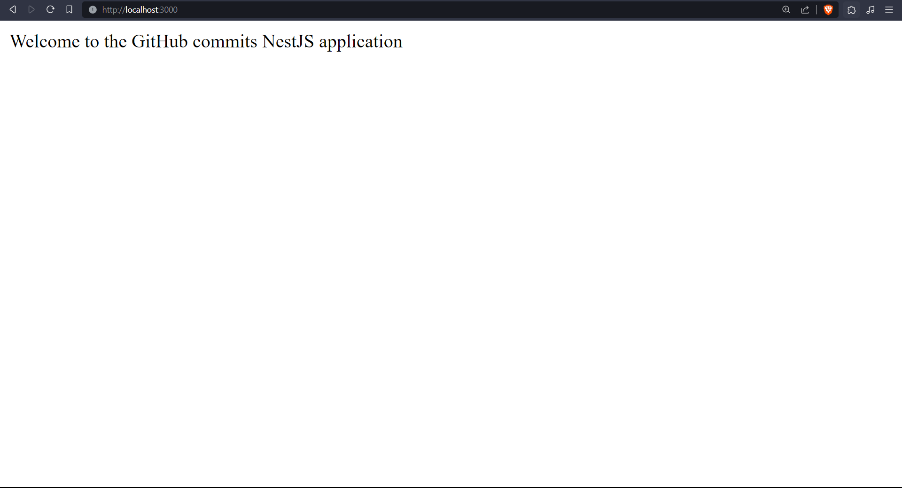

Now, you can test some endpoints to make sure everything is working as expected, here's a list of all the endpoints with an example URL that you can try in your browser:

> To test if this endpoints are working, simply copy and paste each example in the browser, you could also use Postman or Curl. Note that the backend server should already be running. If you didn't followed the instructions in order and your backend development server is not running check the [usage instructions](#usage)

```
# GET all commits
# endpoint
/commits
#example
http://localhost:3000/commits

# GET commits by author
# endpoint
/commits/author?author=name
# example
http://localhost:3000/commits/author?author=jorgeabrahan

# GET commits by date
# endpoint
/commits/date?dateSince=date&dateUntil=date
# example
http://localhost:3000/commits/date?dateSince=2023-10-01&dateUntil=2023-10-31

# GET commits by keyword
# endpoint
/commits/keyword?keyword=keyword
# example
http://localhost:3000/commits/keyword?keyword=create

# GET commits by filters
# endpoint
/commits/filters?author=name&dateSince=date&dateUntil=date&keyword=keyword
# example
http://localhost:3000/commits/filters?author=jorgeabrahan&dateSince=2023-10-01&dateUntil=2023-10-31&keyword=create
```

#### frontend

Astro listens on port **4321** by default, therefore you'll need to open the following url in your browser:

```
http://localhost:4321
```

This will prompt the home page with a list of the commits from this public repository, which indicates that Astro is up and running.


For each endpoint in the backend there's an astro page to test it:

- [**index**](http://localhost:4321/) (home page) shows a list of the repository history commits
  - endpoint: http://localhost:3000/commits
- [**author**](http://localhost:4321/author) allows you to filter the commits by an author name
  - endpoint: http://localhost:3000/commits/author?author=jorgeabrahan
- [**date**](http://localhost:4321/date) allows you to filter the commits by an initial and end date
  - endpoint: http://localhost:3000/commits/date?dateSince=2023-10-01&dateUntil=2023-10-31
- [**keyword**](http://localhost:4321/keyword) allows you to filter the commits by a keyword
  - endpoint: http://localhost:3000/commits/keyword?keyword=create
- [**filter**](http://localhost:4321/filter) allows you to apply all previous filters
  - endpoint: http://localhost:3000/commits/filters?author=jorgeabrahan&dateSince=2023-10-01&dateUntil=2023-10-31&keyword=create

### Stop the server

Once you've finished testing the application you can stop the server from running (both Astro and NestJS development server) by opening the terminals where the server is running and pressing:

<kbd>Ctrl</kbd> + <kbd>C</kbd> in Windows or <kbd>⌘</kbd> + <kbd>C</kbd> in MacOS

### Run tests

Even thouth this is not a mandatory step, in case you want to run tests to make sure all endpoints are working as expected you can type the following commands:

> you should already be positioned in the project folder if you're following the instructions in order, if not, start from the [setup instructions](#setup)

```sh
# navigate to backend
cd backend
# run tests
npm run test
```

And that's it, you should see an output similar to this:

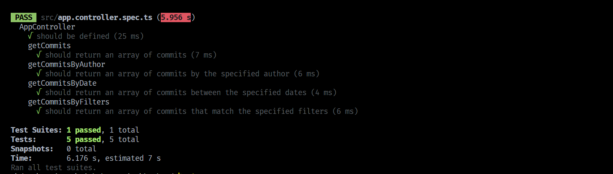

<p align="right">(<a href="#readme-top">back to top</a>)</p>

## 👥 Authors <a name="authors"></a>

👤 **Jorge Abrahan**

- GitHub: [@jorgeabrahan](https://github.com/jorgeabrahan)
- LinkedIn: [Jorge Abrahan](https://www.linkedin.com/in/jorge-siguenza/?locale=en_US)

<p align="right">(<a href="#readme-top">back to top</a>)</p>

## 🔭 Future Features <a name="future-features"></a>

- [ ] **Create tests for the frontend project**
- [ ] **Create a pagination**

<p align="right">(<a href="#readme-top">back to top</a>)</p>

## 🤝 Contributing <a name="contributing"></a>

Contributions, issues, and feature requests are welcome!

Feel free to check the [issues page](../../issues/).

<p align="right">(<a href="#readme-top">back to top</a>)</p>

## 🙏 Acknowledgments <a name="acknowledgements"></a>

This whole project idea is from a take home test, whish me luck 😄!

<p align="right">(<a href="#readme-top">back to top</a>)</p>

## 📝 License <a name="license"></a>

This project is [MIT](./LICENSE) licensed.

<p align="right">(<a href="#readme-top">back to top</a>)</p>
